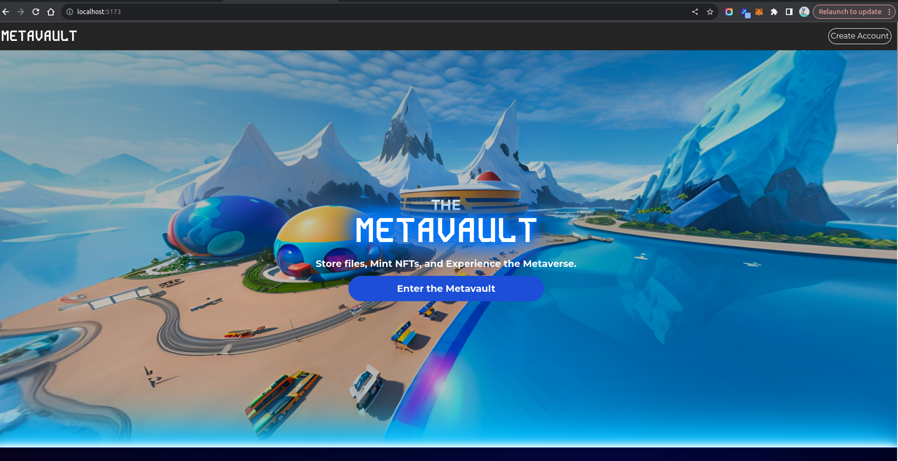
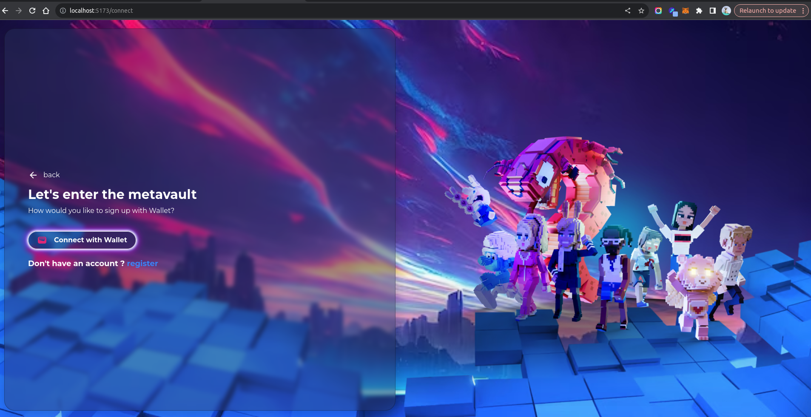
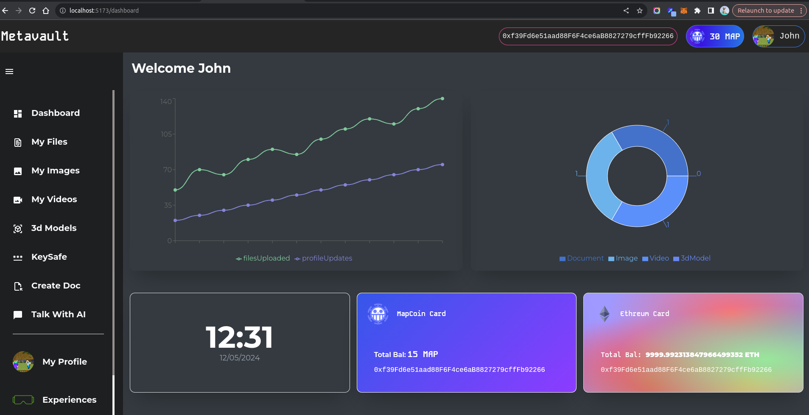
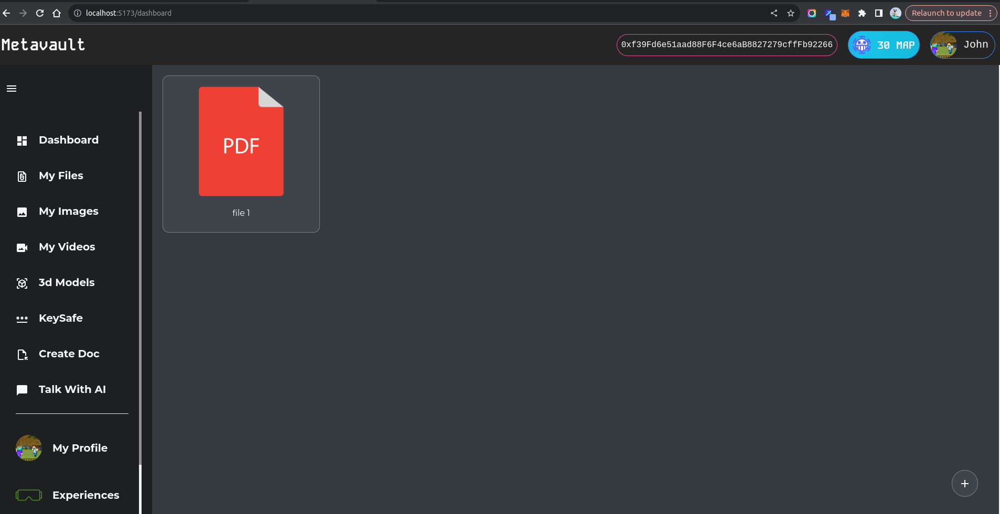
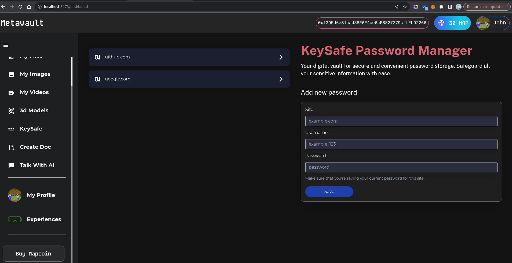
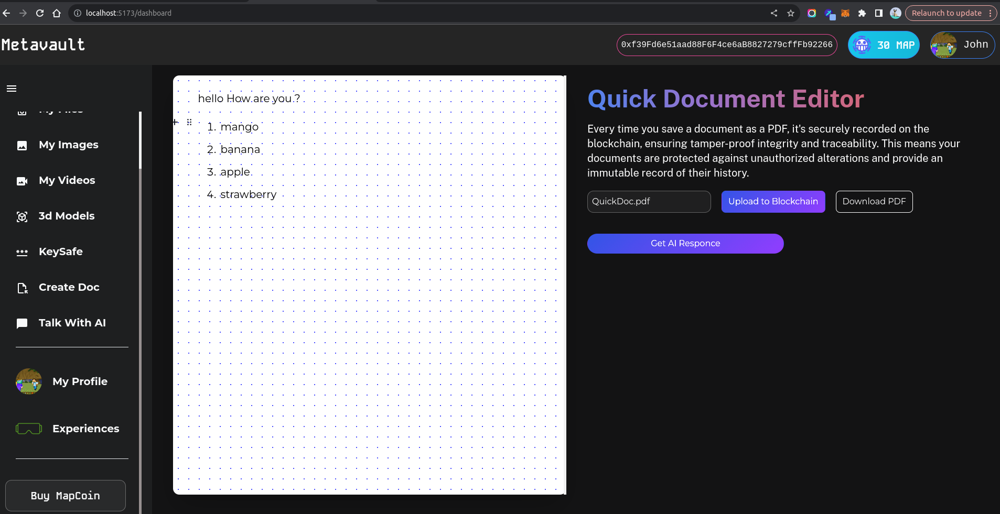
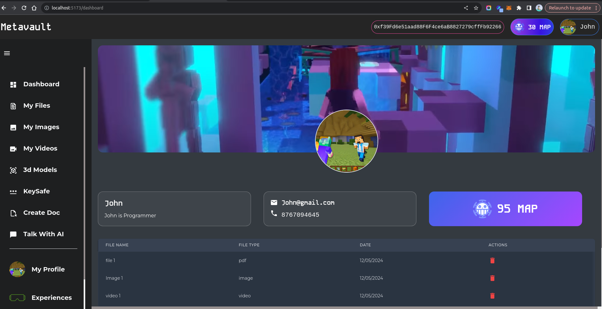
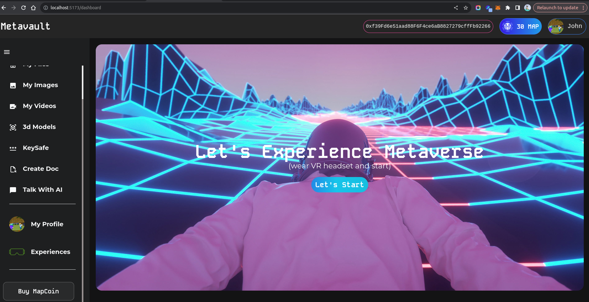
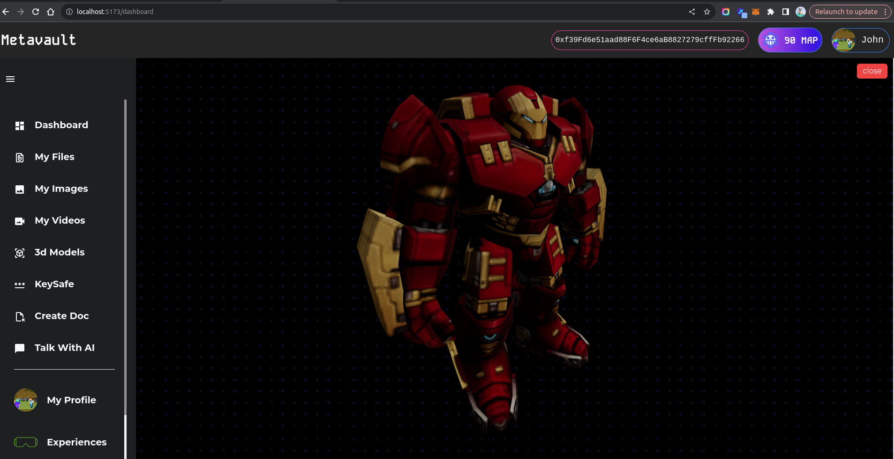
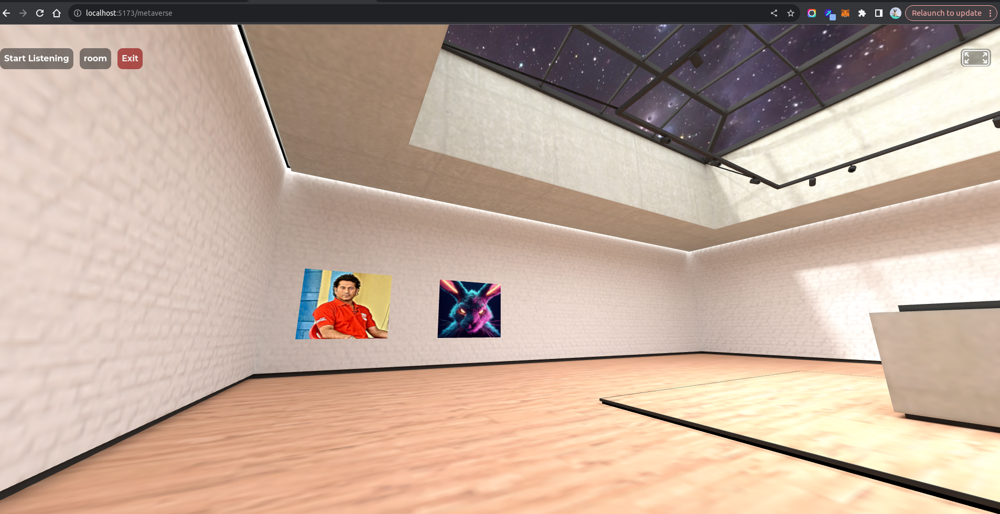

# MetaVault

**Visit my portfolio for more exciting projects: [Mangesh Chate's Portfolio](https://mangeshchate.netlify.app/)**

# MetaVault <small>[<a href="#screenshots" style="text-decoration: underline;">Jump to Screenshots</a>]</small>

## Description

MetaVault is an e-vault system built on blockchain technology, allowing users to securely upload and store various types of digital assets such as images, files, and 3D models. Additionally, MetaVault integrates features that enable users to interact with the metaverse.

<mark style="background-color: yellow;">**Note:** You need to install the MetaMask wallet extension to use MetaVault. [Get MetaMask here](https://metamask.io/download.html).</mark>

## Project Structure

The project structure consists of two main folders:

- **blockend**: Contains the codebase for the Foundrybook blockchain framework.
- **client**: Holds the frontend codebase developed using React with Vite.

## Installation

### Frontend (Client)

1. Navigate to the `client` folder.
2. Run `npm install` to install dependencies.
3. To start the development server, run `npm run dev`.

### Foundrybook (Blockend)

1. Navigate to the `blockend` folder.
2. Follow the installation instructions provided in the Foundrybook documentation.
3. Once installed, start the Foundrybook server.

## Metamask Setup and Testing

### Installation

1. Install the MetaMask browser extension from [here](https://metamask.io/download.html).
2. Set up a MetaMask wallet by following the on-screen instructions.

### Testnet Configuration

1. Switch MetaMask network to the desired testnet (e.g., Ropsten, Rinkeby, etc.).
2. Ensure you have testnet Ethereum (ETH) in your wallet for transactions.

### Using Anvil with Local MetaMask Account

1. Start the Anvil service as per the instructions provided in the Foundrybook documentation.
2. Connect your MetaMask wallet to Anvil by following the provided steps.
3. Use your local MetaMask account to interact with the Anvil service.

## Interacting with the Metaverse

1. Once the project is set up and running, users can interact with the metaverse features through the frontend interface.
2. Explore and engage with the metaverse functionalities seamlessly integrated into MetaVault.

## Screenshots

Here are some screenshots demonstrating various features of MetaVault:

- 
- 
- 
- 
- 
- 
- 
- 
- 
- 
- 

## Portfolio

For more of my work, you can visit my portfolio at [Mangesh Chate's Portfolio](https://mangeshchate.netlify.app/).

## Warning

Please make sure to use the MetaMask wallet for interacting with the MetaVault system. Using any other wallet might result in unexpected behavior.
